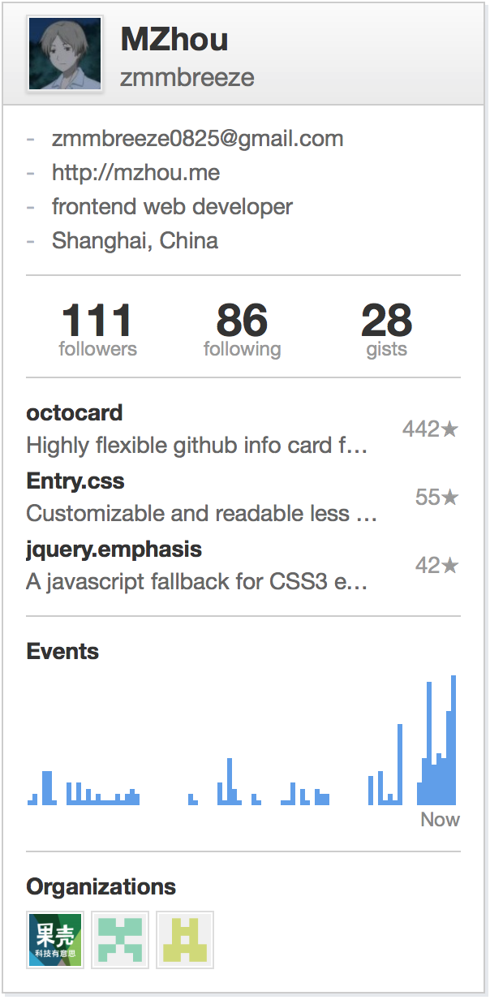

Octocard
===
Highly flexible github info card for every github lover. And it's open source. Please feel free to fork and build your own Octocard.



How to use
---
Easy way? Copy the following html code to your website.

    ```html
    <script
        data-name="your github username"
        src="http://nodejs.in/octocard/bin/octocard.js"></script>
    ```

Advanced way:

    ```html
    <div id="octocard"></div>
    <script>
    OCTOCARD = {
      // [required][string] Username.
      name: 'zmmbreeze',

      // [optional][string|Element]
      // element or elementId, `octocard` as default.
      element: 'octocard',

      // [optional][string]
      // Used module names, default is:
      //   `base,details,stats,repos,contributions,orgs`.
      // You can change the order or remove module if you don't want.
      // modules: 'base,details,stats,repos,orgs,eventsStatis',

      // [optional][number] Number of repos to be shown.
      // `3` as default
      // reposNum: 4,

      // [optional][number]repos which will not be shown
      // '' as default
      reposIgnored: 'reponame1,reponame2',

      // [optional][number] Number of organizations to be shown.
      // `Infinity` as default, represent showing all organizations.
      // orgsNum: -1,

      // [optional][string]url of jsonp api
      // `http://octocard.info/api` as default.
      // If your use your own octocard-server, change it.
      // api: 'http://your-octocard-server.com/api',

      // [optional][boolean]show footer or not
      // 'false' as default
      // noFooter: false,

      // [optional][boolean]
      // Use `shadowDom` or `iframe` to create isolate container or not
      // 'false' as default
      // data-noIsolated="true"
    };
    </script>
    <script src="http://nodejs.in/octocard/bin/octocard.js"></script>
    ```

These configs also work as `data-*` attributes.

How to customize theme
---

1. `git clone https://github.com/zmmbreeze/octocard.git`
2. `cd octocard/themes`
3. `cp default.css mytheme.css`
4. Change the css style as you wish.
5. `cd ../`
6. `npm install`
7. `grunt --theme=mytheme`
8. Then your will get `bin/octocard.mytheme.js`.


Server part
---
Octocard works on node server. You can use [octocard.info](http://octocard.info/). It's free. But if you want to build your own server, checkout [server part](https://github.com/zmmbreeze/octocard-server).


